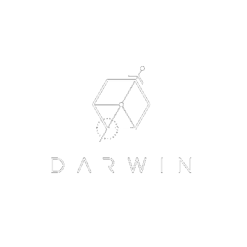

# Darwin Eleet Tracker

 

  

  <h3 align="center">Eleet Code Tracker</h3>

  

            
<em>ELEET-TRACKER</em> is a service that has your future in mind. We know you are well on your way to become the best Software Engineer you can be, and we're here for you. We bring to you a service that allows you to track, record, and analyze your performance on the leetcode problems you attempt, so you can see how you stack up against the fiercest competition out there - yourself.

  

## App Preview
 

 
    <h3 align="center">Authentication and Toastify Notifications</h3>

   
    <h3 align="center">Input Submission, Dashboard and Graphs</h3>

   
    <h3 align="center">Records Library</h3>

   
  

## Components and Contributors

Architect Owner and Records: Gil Cohen  
Firebase Authentication and Firestore DBMS: Alex Krut, Junsu Park  
Dashboard and UI: Zebib Gebraslassie  
Input Form and UI: Jerry Tapia  
Graphs: Xiaohuan Hu, Junsu Park  

React Router: Gil Cohen, Jerry Tapia  
React Toastify and Badges: Alex Krut  
React Global Context API: Gil Cohen  

## LOCAL SETUP

In the project directory, begin by running:

#### `npm install`

to install dependencies for the project.

to run the project locally, type in 
#### `npm start`

This will run the app in the development mode.\
Open [http://localhost:3000](http://localhost:3000) to view it in your browser.

The page will reload when you make changes.\
You may also see any lint errors in the console.

Additionally, you will need to initiate the server file by typing: 
#### `npm run server-dev`

which will start the server that will route front-end requests to Firebase.

## FIREBASE SETUP

Create a firebase account and setup a new Project

[https://console.firebase.google.com/u/0/](https://console.firebase.google.com/u/0/)

Once created, “Build” the following 2 services on Firebase:

1. Authentication 
- Set it up with the option for Name and Password

 2. Firestore Database [not Realtime db]
- Toggle this to be 'Production' ready
- Copy the following Rule into the 'RULES' tab for 
`rules_version = '2';
service cloud.firestore {
match /databases/{database}/documents {
match /users/{userId}/{documents=**} {
allow read, write: if true;
}
}
}`
- Settings > Project Settings > General > Your apps > click the </> icon (****Add Firebase to your web app)****

- Follow the instructions provided and install firebase locally
- Copy and rename your env.copy file into a blank '.env file'. Make sure this file is greyed out (part of .gitignore file).
  - Add apiKey, authDomain, projectId, storageBucket, messagingSenderId, appId to the .ENV file you made earlier (located in the root of file).
    - REACT_APP_DATABASE_URL inside .env file will be the “name_of_project.firebaseio.com”

Test that everything works by registering a new user and submitting your first problem.

## Technologies Used

- Setup and Configuration \

- Front End Development : Javascript, React.js, React Router, React Toastify, Apache Echarts, Axios, Material UI, HTML, CSS \

- Back End Development: Node.js, Express.js, Firebase, Firestore \

- Deployment: Firebase Hosting

- Team Collaboration: \

## Contact

#### ZEBIB
Github: zebibg  
Email: zgebres@gmail.com

#### GIL
Github: gilcohen67  
Email: gil.cohen67@gmail.com

#### XIAOHUAN
Github: xiaohuan0319  
Email: huxiaohuan.jlu@gmail.com

#### JUNSU
Github: junsupark94  
Email: junsupark94@gmail.com

#### JERRY 
Github: jerrytapia  
Email: jerryxtapia@gmail.com

#### ALEX
Github: EtoKruto  
Email: akrut26@gmail.com

(<a href="#top">back to top</a>)

